# Forge

**Self-hosted AI for your whole household or team — chat and agentic coding on
your own GPUs, from any device on your LAN.**

Forge gives every person on your network their own profile: a general-purpose
**chat** with persistent history and long-term memory, plus Claude Code-style
**coding sessions** — an agent that reads, writes, runs, and commits code in a
sandboxed workspace — powered entirely by open-weight models running on local
hardware. There are **no external LLM providers anywhere**: no API keys, no
per-token bills, no conversations leaving your network. The only outbound traffic is model downloads from Hugging Face, git
operations, and whatever your agent's own tools fetch. A weekly registry job
watches Hugging Face for new models that fit your hardware and files
suggestions; nothing is downloaded without your approval.

Under the hood, a FastAPI **orchestrator** is the brain: it manages per-GPU
engine leases across four text-inference lanes (llama.cpp, vLLM, SGLang, AirLLM), spawns
one sandboxed [OpenCode](https://opencode.ai) container per coding session over
the host Docker socket, streams everything to a custom React **PWA** you can
install on your phone, and wires MCP connectors (GitHub, web fetch, SearXNG
search, Playwright browser automation) plus Claude Code-format **skills** into
every session.

```
                            phone / laptop on LAN
                                    │  http://<host>:8080
                            ┌───────▼────────┐
                            │  gateway       │  Caddy: serves PWA,
                            │  (caddy :8080) │  proxies /api/* ↓
                            └───────┬────────┘
                                    │
                     ┌──────────────▼───────────────┐
                     │  orchestrator (FastAPI)      │
                     │  auth · engine lease · tasks │
                     │  registry · downloads · SSE  │
                     └──┬───────────┬────────────┬──┘
              docker sock│           │            │
        starts ONE of:   │           │ spawns     │ MCP / search
   ┌─────────────────────▼──┐   ┌────▼────────┐  ┌▼──────────────┐
   │ llama.cpp :8081  (GPU) │   │ session-<id>│  │ searxng       │
   │ vLLM      :8082  (GPU) │   │ OpenCode    │  │ mcp-playwright│
   │ SGLang    :8085  (GPU) │◄──┤ :4096       │  └───────────────┘
   │ AirLLM    :8083  (GPU) │   │ /workspace  │
   └────────────────────────┘   │ /skills:ro  │   × N parallel sessions
     OpenAI-compatible /v1      └─────────────┘
```

The PWA never talks to session containers directly — the orchestrator proxies
every OpenCode call and streams events over SSE, so per-profile bearer tokens
guard everything.

## Screenshots

| | |
|---|---|
| **Chat** — every profile gets its own conversations: history, attachments, temporary mode | **Memory** — what Forge has learned about you: per-user, inspectable, pinnable |
| 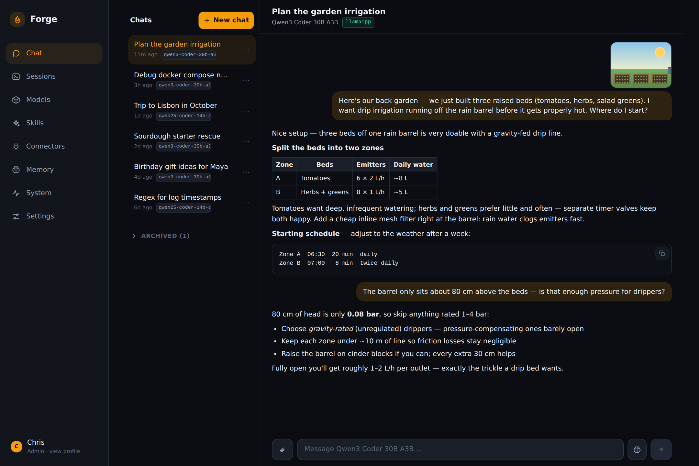 | 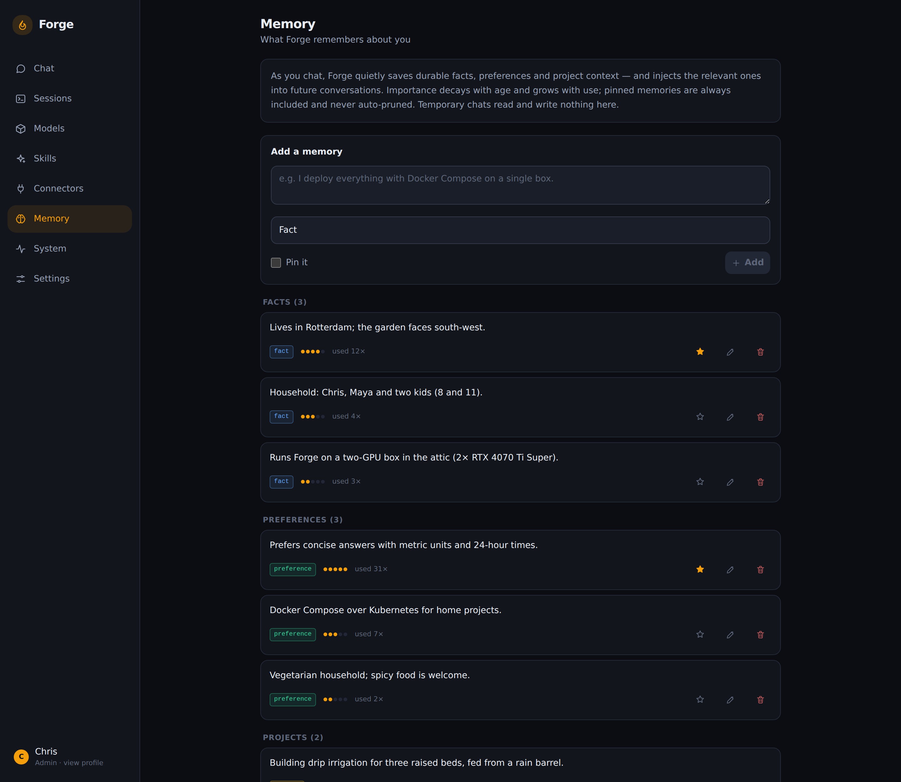 |
| **Sessions** — one sandboxed OpenCode container per task | **Session chat** — streamed tool calls: read, edit, test |
| 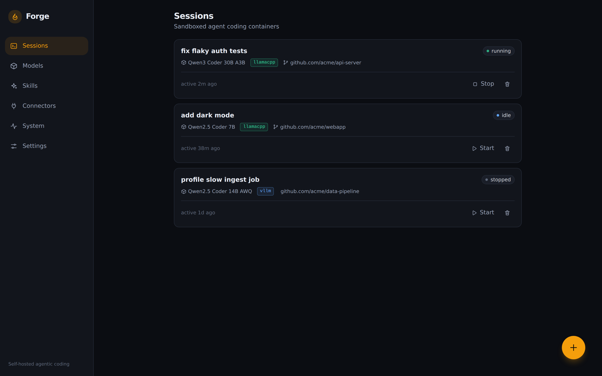 | 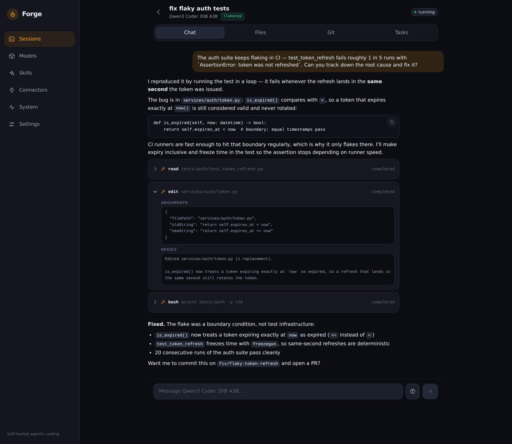 |
| **Models** — registry suggestions and per-GPU engine leases | **System** — live gauges for every GPU, RAM, disk and CPU |
| 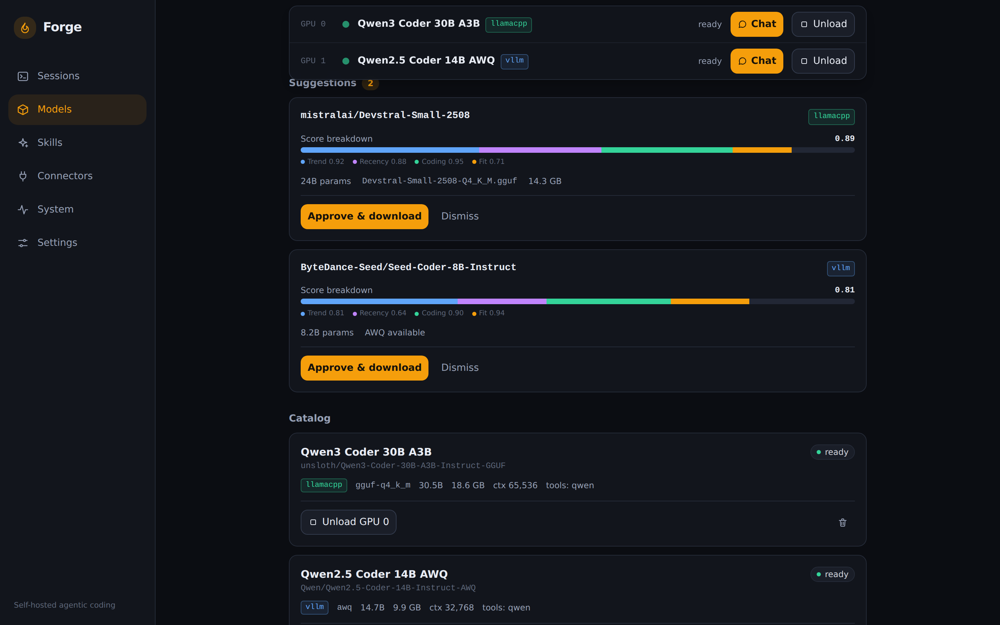 | 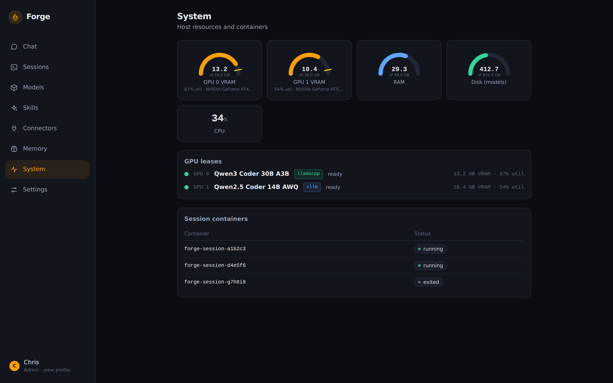 |

**Connectors** — the MCP catalog: the five core connectors plus one-toggle
integrations (Notion, Linear, Sentry, Stripe, Figma, …) and custom MCP servers.

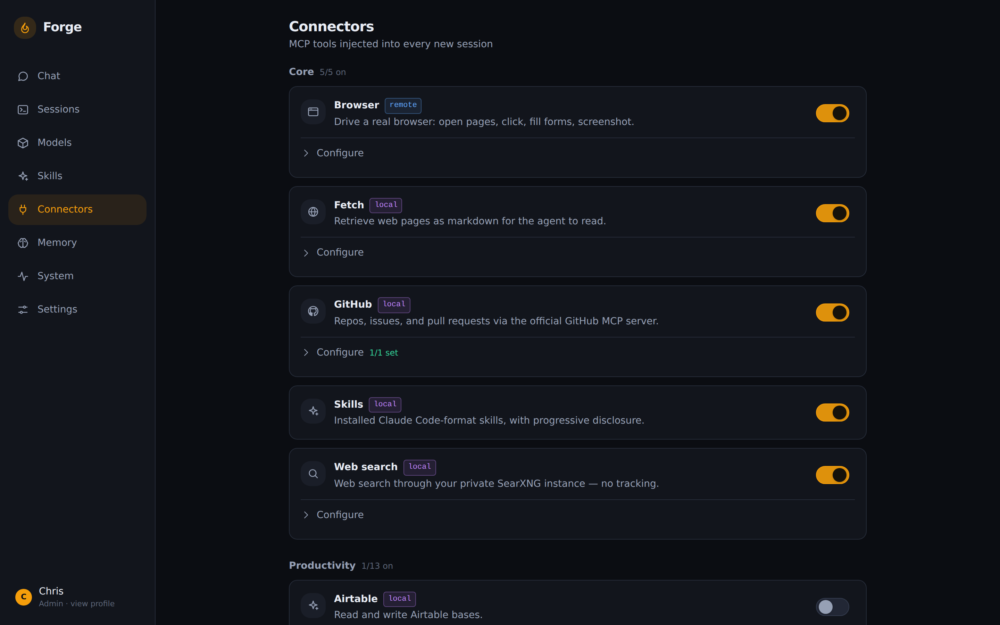

On first boot a setup wizard creates the admin profile; everyone else on the
LAN registers from the login screen:

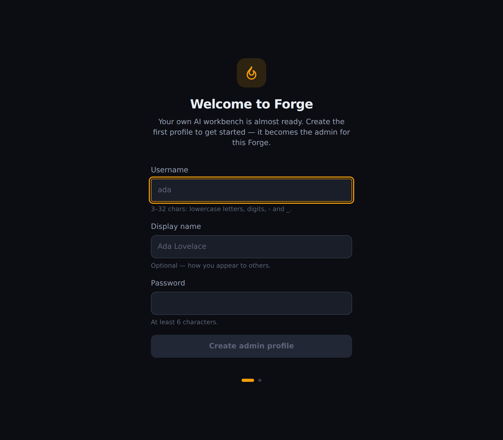

On a phone the same PWA installs from the browser and gets a bottom tab bar:

<p>
  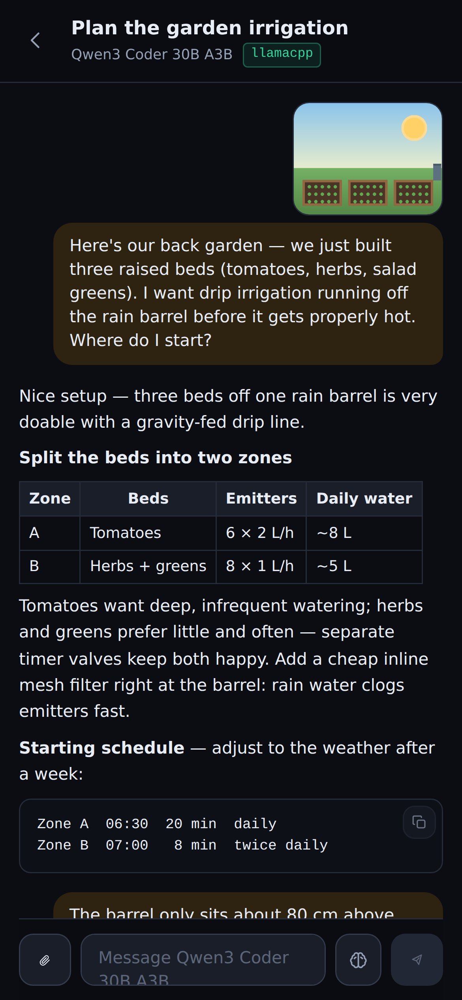
  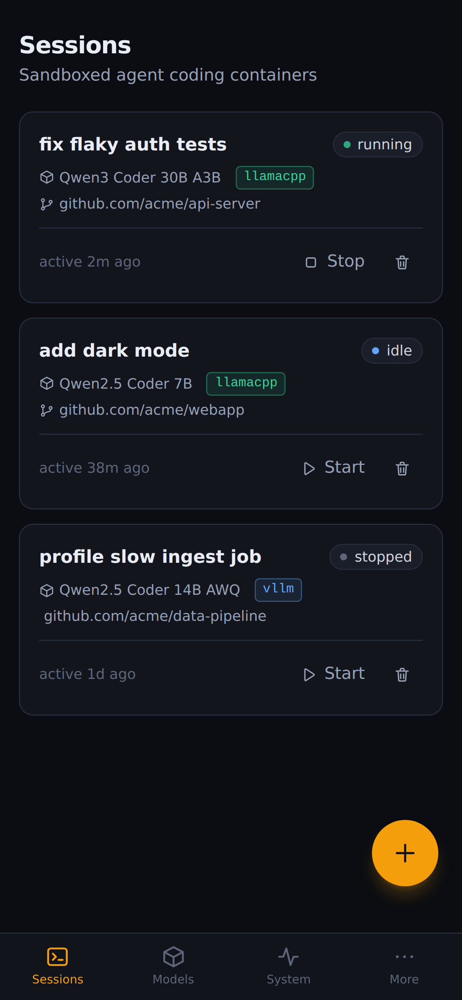
  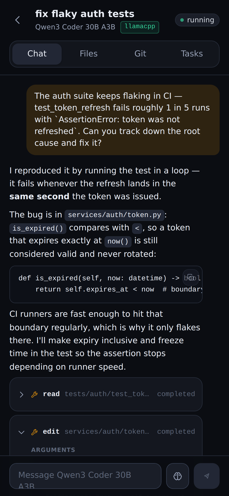
  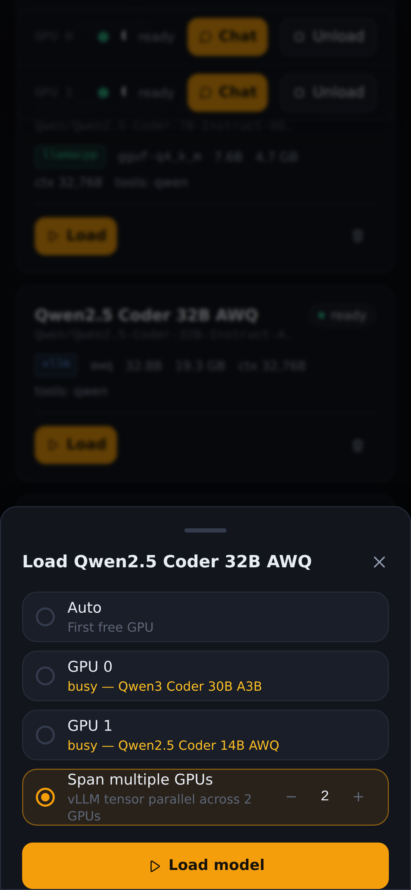
  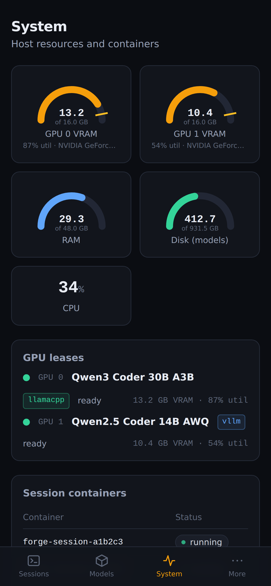
</p>

## Hardware target

Built for a single-GPU workstation; the reference box is:

- **GPU:** RTX 4070 Ti Super, 12 GB VRAM (budgets assume ~11 GB usable)
- **RAM:** 48 GB (up to 32 GB used for CPU-offloaded model layers)
- **Disk:** NVMe, tens of GB free for model weights
- **OS:** Linux with Docker Engine + [NVIDIA Container Toolkit](https://docs.nvidia.com/datacenter/cloud-native/container-toolkit/latest/install-guide.html)

Different hardware? Adjust `FORGE_VRAM_BUDGET_GB` and
`FORGE_RAM_OFFLOAD_BUDGET_GB` in `.env` — the fit rules, registry scoring, and
`--n-gpu-layers` computation all read those budgets.

## Quick start

```bash
git clone <your-forge-repo> forge && cd forge
make up
```

**No `make`?** A standalone first-run script does the identical bring-up on any
host with Docker — the right choice on Windows or a bare server:

```bash
# Linux / macOS
scripts/setup.sh                     # add --sandbox for the code-run lane
```
```powershell
# Windows (PowerShell, Docker Desktop)
powershell -ExecutionPolicy Bypass -File scripts\setup.ps1
```

Both scripts run the same steps as `make up` (preflight → `.env` + secrets →
GPU-overlay detection → build/start → engine prefetch → sweep stale lane
containers → **verify**: every always-on service running, orchestrator
healthy, gateway answering, all local images built) and are re-runnable.
Re-check a running stack any time with `make verify` / `scripts/verify.sh`.

That's the whole setup — no manual `.env` step. `make up` (and the setup
scripts):

1. runs a **preflight check** (`scripts/preflight.sh`): docker + compose v2
   are hard requirements with actionable messages; no GPU, low disk, or no
   KVM only warn;
2. creates `.env` from `.env.example` on first run and generates
   `SEARXNG_SECRET` into it (idempotent — an existing `.env` is left alone);
3. auto-includes the **GPU overlay** (`docker-compose.gpu.yml`) when
   `nvidia-smi` is present — on a **CPU-only box** the stack comes up cleanly
   with plain compose and GPU stats simply show unavailable;
4. builds the session-runner and locally-built engine images, and prefetches
   the big llama.cpp/vLLM engine images (skip with `FORGE_SKIP_PULL=1`).

On first boot the orchestrator initializes the database, **seeds the starter
model catalog automatically** (`make seed` exists only for re-seeding), and
waits for you. Open `http://<host-ip>:8080` from any device on your LAN — the
**setup wizard** asks you to create the first profile (it becomes the admin),
and from then on anyone on the LAN can visit the same URL and register their
own profile. On your phone, use the browser's **"Add to Home Screen" /
"Install app"** — the UI is an installable PWA with a mobile-first layout.

The optional **sandbox lane** (hardware-isolated microVMs for the "run this
code" tool) is not built by `make up`: it needs `/dev/kvm` on the host — run
`make sandbox` to opt in.

`make help` lists all targets (`up`, `down`, `logs`, `seed`, `smoke`, `test`,
`dev`, `sandbox`, `clean`).

## First run

1. **Create your profile** — the setup wizard appears automatically on a
   fresh install. The first profile is the admin; everyone else on the LAN
   registers from the login screen (the admin can close registration in
   Settings). Each profile has its own chats, memory, connectors, sessions,
   and personal instructions.
2. **Pick a model** — the starter catalog is seeded automatically on first
   boot (Qwen2.5 Coder 14B AWQ + GGUF, Qwen3 Coder 30B-A3B MoE — the expected
   daily driver, gpt-oss-20b, and a 7B utility model), arriving as
   `approved` — nothing is downloaded without a click.
3. **Download a model** — Models page → pick one → **Download**. Progress
   streams live. Start with the 7B if you want a quick end-to-end check.
4. **Load it** — Models page → **Load**. The orchestrator starts the right
   engine container with computed flags and holds the single GPU lease; the
   VRAM gauge and lease state update live. Big GGUFs can take minutes.
5. **Chat or code** — the **Chat** tab is the everyday surface: ask
   anything, attach images and files, continue old conversations, or flip on
   a temporary chat that stores nothing. For agentic coding, create a
   **session** — Sessions page → **New session**, pick the loaded
   model, optionally paste a `repo_url` to clone. Then chat: ask it to build
   something and watch the streamed tool calls, edit files in Files, and
   commit from Git.

Fire-and-forget prompts go through **tasks** (`POST
/api/sessions/{id}/tasks`) — run several sessions in parallel and track them
in the parallel-runs view.

## Engine lanes

Five engine lanes sit behind the same OpenAI-compatible surface; the
orchestrator enforces **one engine per GPU** (loading onto a busy GPU returns
HTTP 409 with the lease holders). With one GPU that means one engine at a
time; with several, each GPU serves its own model concurrently, and the
vLLM/SGLang lanes can span N free GPUs with tensor parallelism (`gpu_count`
on load).
Sessions never care where a model landed — the orchestrator's `/v1` model
router forwards each request to whichever engine serves its model. From
PLAN §9 (budgets are per GPU):

| Lane | What fits (approx) | Example |
|---|---|---|
| SGLang (11 GB VRAM) | any native safetensors that fits: ≤ ~4B bf16, bigger with embedded awq/gptq/fp8 | Qwen3 4B bf16, 7B AWQ |
| vLLM (11 GB VRAM) | ≤ 15B dense @ 4-bit AWQ variant builds, 16k ctx | Qwen coder 14B AWQ |
| llama.cpp full-GPU | GGUF ≤ ~10 GB file | 14B Q4_K_M |
| llama.cpp offload | GGUF ≤ ~40 GB file (VRAM + 32 GB RAM), MoE strongly preferred | 30B-A3B class Q4/Q5 |
| AirLLM | ≤ 70B fp16-from-disk, **chat-only** | 70B instruct |
| imagegen | diffusers text-to-image, fp16 | SDXL-Turbo |

**The engine is picked automatically.** Every add path (Hub search, the
suggestions feed, manual add with no engine chosen, and `POST
/api/models/{id}/refit`) reads the checkpoint's real `config.json` —
architectures, `model_type`, `quantization_config`, custom code — plus the
repo listing, and `fit_rules.detect_lane` decides: GGUF that fits →
llama.cpp; checkpoint that fits VRAM as published → SGLang; separate AWQ
variant → vLLM; too big but standard → AirLLM. It also refuses honestly:
a speculative-decoding **draft** model (e.g. `RadixArk/Kimi-K3-DSpark`, a
SpecForge DSpark checkpoint that accelerates a target model inside SGLang)
is named as such instead of being sent to a lane that can never chat with
it, and a custom-code architecture with no GGUF conversion says so.

Notes:

- **llama.cpp** is the default lane. `--n-gpu-layers` is computed per model to
  fill VRAM; the rest offloads to RAM. `--parallel 2` slots let two sessions
  share one server (each slot splits the context budget).
- **vLLM** is the fast lane for ≤14B AWQ models, with
  `--enable-auto-tool-choice` and a per-model tool-call parser.
- **AirLLM** is the slow lane for over-VRAM models: seconds-to-minutes per
  token, no tool calling, chat only — it never appears in the session model
  picker. Talk to it (or any loaded model) via **Chat with model** on the
  Models page once its lease is ready.
- **imagegen** serves a diffusers text-to-image pipeline behind the OpenAI
  Images API for chat image generation. Like AirLLM it never powers coding
  sessions, and it is excluded from the `/v1` chat router. SDXL-Turbo ships
  in the seed catalog (1-4 step generation — seconds per image).

### Context compression

On a 12 GB card the scarcest resource is context (KV-cache VRAM). Forge chains
all chat-completion traffic through
[Headroom](https://github.com/headroomlabs-ai/headroom), a self-hosted
compression proxy that shrinks tool outputs, logs, JSON, and code before they
reach the model — so agent sessions overflow the window less and prefill
faster. It runs offline (no model downloads) and is a toggle on the Settings
page. If the proxy is down, traffic **automatically falls back** to the direct
engine path, so a stopped container degrades to plain Forge rather than
breaking chat.

### Run code safely

The optional **sandbox lane** ([smolvm](https://github.com/smol-machines/smolvm))
boots hardware-isolated microVMs to run untrusted code — the Chat **run**
button on a Python/JavaScript/Bash block executes it with **no network**, a
hard timeout, and captured output. It needs `/dev/kvm` on the host and is
opt-in: `make sandbox`. Its control API has no auth and stays strictly on the
internal network.

## Profiles, chat & memory

Forge is **multi-user**: every person on the LAN gets their own profile with
separate chat history, memory, connectors (and tokens), coding sessions,
personal instructions, and settings. Registration is open by default and the
admin can close it.

The **Chat** section is a full conversational surface backed by whatever model
holds a GPU lease:

- **History & continuation** — every conversation is stored per profile;
  reopen any chat and keep going. Titles are generated automatically.
- **Temporary chats** — one toggle gives you an incognito chat that is never
  stored and never reads or writes memory.
- **Attachments** — drop in images and files. Text and PDFs are read into
  context; images go to the model when it is vision-capable (and are honestly
  labeled as not-viewable otherwise).
- **Image generation** — ask for an image right in chat (image mode or
  `/imagine …`). Forge renders it on the local imagegen lane (SDXL-Turbo out
  of the box) or through an enabled connector like Higgsfield, and saves the
  result into the conversation as a downloadable attachment.
- **Memory** — Forge learns durable facts, preferences, and projects from
  your saved chats, retrieves the relevant ones per message under a strict
  token budget, and compresses long conversations into rolling summaries so
  month-old chats resume for a few thousand tokens. Inspect, edit, pin, or
  wipe everything on the Memory page; see [docs/memory.md](docs/memory.md)
  for the full design.

## Thinking levels

Every prompt — session chat, fire-and-forget tasks, and the model chat page —
takes a **thinking level**: `Auto` (the model's native default), `Off`, `Low`,
or `High`. Forge maps the level to each model family's real mechanism: Qwen3
gets its official `/think` · `/no_think` soft switches, gpt-oss gets a
`Reasoning: low|high` system line, and other instruct models get plain-language
directives. Pick it from the brain icon next to the composer; chats remember
the level per session.

## Adding models

**By search:** Models page → search box (or `GET /api/models/search?q=…&kind=text|image`)
finds a specific model on Hugging Face — chat/code models or text-to-image
models. One click on **Add** resolves the right artifact and lane
automatically (AWQ → vLLM, single-file GGUF → llama.cpp full-GPU or offload,
otherwise AirLLM; image models → the imagegen lane) and starts the download.

**Manually:** Models page → **Add model** (or `POST /api/models`) with the
Hugging Face repo id, engine lane, and — for llama.cpp — the exact `.gguf`
filename from the repo (e.g. `Qwen2.5-Coder-14B-Instruct-Q4_K_M.gguf`; the
file must live at the repo root, single-file quants only). Set
`tool_call_format` (`hermes` for Qwen-family, `llama3` for Llama-family,
`none` to disable tools).

**Via registry suggestions:** a weekly scheduled scan (cron in
`FORGE_REGISTRY_CRON`, trigger manually with `POST /api/models/registry/scan`)
ranks trending Hugging Face text-generation models by trend, recency, coding
signal, and hardware fit. Anything promising lands in the **suggestion inbox**
on the Models page with a score breakdown. Approve → it downloads and becomes
loadable; dismiss → never suggested again. Suggest-only by design: no weights
are fetched without your click.

## Skills (Claude Code format)

Forge installs and serves skills in the [Claude Code / Agent
Skills](https://github.com/anthropics/skills) layout: a directory with a
`SKILL.md` whose YAML frontmatter has `name:` and `description:`, plus any
support files.

- **Install:** Skills page → install from a git URL (optionally a subdir), or
  `POST /api/skills/install {"git_url": "...", "subdir": "..."}`. Community
  repos following the anthropics/skills layout work as-is.
- **Suggested skills:** the Skills page also offers a curated one-click catalog
  of ~40 vetted skills from [ECC](https://github.com/affaan-m/ECC) (MIT) —
  TDD, verification loops, security review, and language/framework patterns for
  Python, TypeScript, React, Go, Rust, Docker and more — grouped by category.
- **Import a skill pack:** point the importer at any git repo of skills, scan
  it, and batch-install a selection. Bulk-imported skills arrive **disabled**
  (so they don't flood the model's tool listing) — toggle on the ones you want.
- **Use:** every session container gets a read-only `/skills` mount and a
  built-in skills MCP server exposing `list_skills` / `load_skill`. Models see
  only names and descriptions until a skill is loaded — the same progressive
  disclosure Claude Code uses.

## Connectors (MCP)

Sessions come wired with MCP servers, toggled per connector on the Connectors
page. Five **core** connectors ship with Forge:

| Connector | What it does | Needs |
|---|---|---|
| `github` | Repo/issue/PR operations via github-mcp-server | A GitHub PAT (Connectors page). Off until one is set. |
| `scrapling` | Stealth web fetching — TLS-fingerprint HTTP plus a Cloudflare-capable headless browser, returning markdown | — |
| `searxng` | Web search via the bundled self-hosted SearXNG | — |
| `playwright` | Browser automation (headless, shared service) | — |
| `skills` | The skills server described above | — |

The plain `fetch` connector still exists but ships **off** — `scrapling`
([Scrapling](https://github.com/D4Vinci/Scrapling), a shared `mcp-scrapling`
container) supersedes it on JS-heavy and bot-protected pages. The Chat
composer's **read a page** button uses the same engine server-side: paste a
URL and Forge fetches it (escalating to the stealth browser automatically),
attaching the page as markdown to your next message.

Beyond those, the catalog covers **80+ public integrations** — every
officially hosted, publicly reachable remote MCP server we could verify
(Notion, Linear, Figma, Sentry, Stripe, GitHub remote, GitLab, Neon,
Cloudflare, Grafana, Exa, Context7, DeepWiki, Microsoft Learn, AWS Knowledge,
Higgsfield, and many more) plus a handful of high-value official local
servers — and **custom MCP servers** you define yourself (remote URL +
headers, or a local command). Enable one, paste its token, and every new
session gets the tools. See
[docs/connectors.md](docs/connectors.md) for the full table, per-service token
guidance (several vendors are OAuth-only — the notes are honest about it), and
the custom-connector how-to.

### Sign in with GitHub / Hugging Face (per-user OAuth)

Instead of pasting a shared PAT, each profile can connect its **own**
accounts — the same device-code and PKCE flows Claude Code and Codex use:

- **GitHub** — click *Sign in with GitHub* on the Connectors page, enter the
  short code on github.com, done. Your sessions then clone, push, and drive
  the GitHub MCP as *you*, and the **new-session dialog lets you pick from
  your own public and private repos** instead of pasting a URL.
- **Hugging Face** — *Sign in with Hugging Face* redirects through
  huggingface.co and back. Model search and downloads of gated/private repos
  then run with *your* access (the global `HF_TOKEN` stays as fallback).
  Heads up: the model library is shared by design — weights you download with
  your token become loadable by every profile on this Forge.

One-time admin setup (Settings page → OAuth sign-in apps, or `.env`):

1. **GitHub**: create an [OAuth App](https://github.com/settings/developers)
   (any callback URL) with **Enable Device Flow** ticked; paste its client ID.
2. **Hugging Face**: create a
   [Connected App](https://huggingface.co/settings/applications) with redirect
   URL `http(s)://<your forge host>/oauth/callback`; paste its client ID (and
   secret, if issued).

Signing in fills the connector's regular token slot, so everything that works
with a pasted key works with OAuth — and pasting a key remains fully
supported. Disconnecting (or disabling the connector) cuts access
immediately. The framework is generic (`app/services/oauth_flows.py`): a
provider that offers device or PKCE code grants is one registry entry away.
Most catalog integrations instead run their vendor's own OAuth handshake
inside the session's MCP client, which needs no Forge-side app.

Tokens are stored in SQLite and injected into session containers as
environment variables (never written into config files) — see the security
model below before pasting broadly-scoped credentials.

Forge folds in several open-source projects (Scrapling, ECC skills, Headroom
compression, smolvm sandbox) rather than reinventing them — see
[docs/integrations.md](docs/integrations.md) for what each does, how it's
wired, and what was deliberately left out.

## Security model (v1 — LAN threat model)

Forge v1 assumes a **single trusted user on a trusted LAN**. Concretely:

- **Auth:** one password → bearer token (argon2 hash at rest). Every `/api`
  route is gated except `/api/health` and `/api/auth/login`. No TLS in v1 —
  the gateway listens on plain HTTP :8080.
- **Docker socket:** mounted into the orchestrator **only**. Session
  containers are spawned as siblings and never get the socket, never get the
  GPU, run as non-root with memory/CPU/pid limits.
- **The caveat that matters:** whoever compromises the orchestrator
  effectively has host root via the socket. Accepted for single-user LAN v1;
  sysbox/rootless Docker are the documented hardening path.
- **Secrets:** GitHub PAT and HF token live in SQLite + `.env`. They are never
  baked into images and never logged. LAN-only threat model — treat the box
  accordingly.
- **Agent code execution:** session containers have outbound internet (git,
  pip, npm need it). Code your agent writes and runs is sandboxed only by
  container limits — don't point Forge at repos you wouldn't run locally.

**Do not port-forward :8080 to the internet.**

### Future VPN slot

Remote access is deliberately out of v1, but the compose topology reserves the
slot: add a WireGuard/Tailscale sidecar on the `forge-edge` network and enable
TLS in `gateway/Caddyfile` (a commented block is already there). No other
service needs to change.

## Troubleshooting

- **`make up` fails at preflight** — only missing docker / an unreachable
  daemon / missing compose v2 abort the run, and each FAIL line names the
  fix. A missing GPU or NVIDIA container runtime is a **warning**, not a
  failure: the stack continues in CPU-only mode (engine loads need a GPU).
  Re-run the checks any time with `./scripts/preflight.sh`.
- **Sessions or engines fail with "image ... is not built"** — the
  session-runner / airllm / imagegen images are built by `make up` (they hide
  behind compose profiles, so a raw `docker compose up` skips them). Run
  `make up`, or build them directly: `docker compose --profile build-only
  build session-runner` and `docker compose --profile engines build airllm
  imagegen`. The System page (and `GET /api/system/stats` →
  `missing_images`) shows which are absent; the first llama.cpp/vLLM load
  pulls its image automatically if the prefetch was skipped.
- **Not sure everything is up?** — `make verify` (or `scripts/verify.sh`)
  sweeps lane containers stranded on pre-rebuild images and then checks the
  whole stack: always-on services running, the orchestrator healthcheck,
  the gateway answering on :8080, and the locally-built images. It exits
  non-zero naming exactly what's wrong. The System tab shows the same
  live view (Services card + missing-image banner, which clears itself
  once you build).
- **Engine fails to load / VRAM OOM** — the healthwait treats an engine
  container exit as a failed load: the lease auto-releases and the engine's
  log tail surfaces in the UI (Models/System) and in `GET /api/engines` under
  `lease.error`. Try a smaller quant, a smaller context, or lower
  `FORGE_VRAM_BUDGET_GB`.
- **Session was reaped / "container unreachable"** — idle sessions are stopped
  after `FORGE_SESSION_IDLE_MIN` (default 120) to free resources. Restart it:
  Sessions page → **Start** (or `POST /api/sessions/{id}/start`). The
  workspace volume persists, and OpenCode reloads its session state from it.
- **`make smoke` says "no ready model"** — download a model (UI or `POST
  /api/models/{id}/download`) and re-run; the catalog is seeded automatically
  on first boot, so `make seed` is only needed after wiping the DB.
  `SMOKE_SKIP_MODEL=1 ./scripts/smoke.sh` accepts an infra-only pass.
- **Tool calls are flaky** — open the model's detail view: each catalog entry
  records a `tool_call_format` and a tool-reliability note. Prefer the seeded
  Qwen coder models for agentic work; gpt-oss-20b is seeded chat-only.
- **Everything on fire** — `make logs` tails all compose services; engine and
  session containers are visible via `docker ps` (`forge-engine-*`,
  `forge-session-*`).

## Development

```bash
make dev     # compose dev overrides: orchestrator --reload, Vite HMR on :5173
make test    # orchestrator pytest + UI typecheck
make lint    # ruff + tsc
make smoke   # full end-to-end gate (needs GPU + a downloaded model)
```

Layout: `orchestrator/` (FastAPI + SQLModel + APScheduler + docker-py),
`ui/` (React 18 + TS + Vite PWA), `session-runner/` (OpenCode session image),
`engines/` (llama.cpp/vLLM wrappers + AirLLM + imagegen servers),
`sandbox/smolvm/` (microVM sandbox image), `skills-bundled/` (vendored agent
skills seeded on first boot), `mcp/skills-server/` (skills MCP), `gateway/`
(Caddy), `scripts/` (preflight + smoke + seed). `PLAN.md` is the
authoritative spec. CI (GitHub Actions) runs ruff, pytest, and the UI
typecheck/build — no GPU steps; GPU paths are covered by `make smoke` on the
real host.

## Pinned versions

Exact versions of OpenCode and the MCP packages inside session containers are
pinned (and checksum-verified where applicable) in
[`session-runner/Dockerfile`](session-runner/Dockerfile) — that file's header
is the single source of truth recording the M5 research: `opencode-ai`,
`github-mcp-server`, `uv`/`uvx`, `mcp-server-fetch`, and `mcp-searxng`. Engine
images (`vllm/vllm-openai`, `lmsysorg/sglang`, `mcr.microsoft.com/playwright/mcp`, `searxng`) are
pinned in `docker-compose.yml` / `.env.example` — including the wave-5
services `ghcr.io/d4vinci/scrapling` (web scraper), `headroom` (compression
proxy), and the `smolvm` sandbox build. Bump deliberately: OpenCode API drift
is the main integration risk (PLAN §14), and
`orchestrator/app/services/opencode_client.py` is the single integration
point to re-verify after an upgrade.

## License

See [LICENSE](LICENSE).
